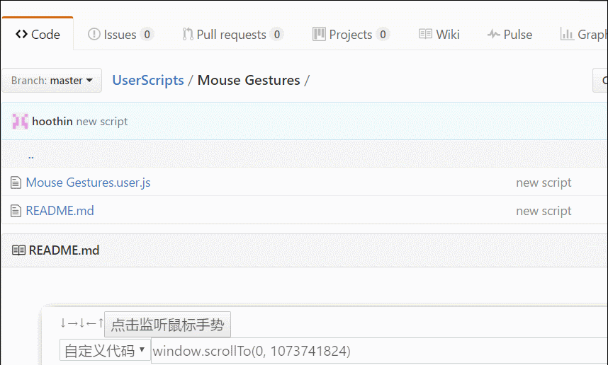

Greasemonkey Mouse Gestures
===
预置的鼠标手势：
---
- ↓↑↓ = 用谷歌翻译当前网页或者选中单词
- ↓↑↓← = 解除当前页面右键、复制、选择等限制
- ↓↑↓→ = 显示淘宝天猫评论买家秀图片
- ↓↑↓↑ = 查看当前页面所使用的各种技术
- ↓→ = 关闭当前页面（标签）
- ←↑ = 滚动至页头
- ←↓ = 滚动至页尾
- →↑← = 后退
- ←↑→ = 前进
- →↑ = 新建页（标签）
- ↑↓ = 刷新

refer to "My Mouse Gestures"-ver.0.0.7 of Peer Zeng at [http://userscripts-mirror.org/scripts/show/463904], thanks to him