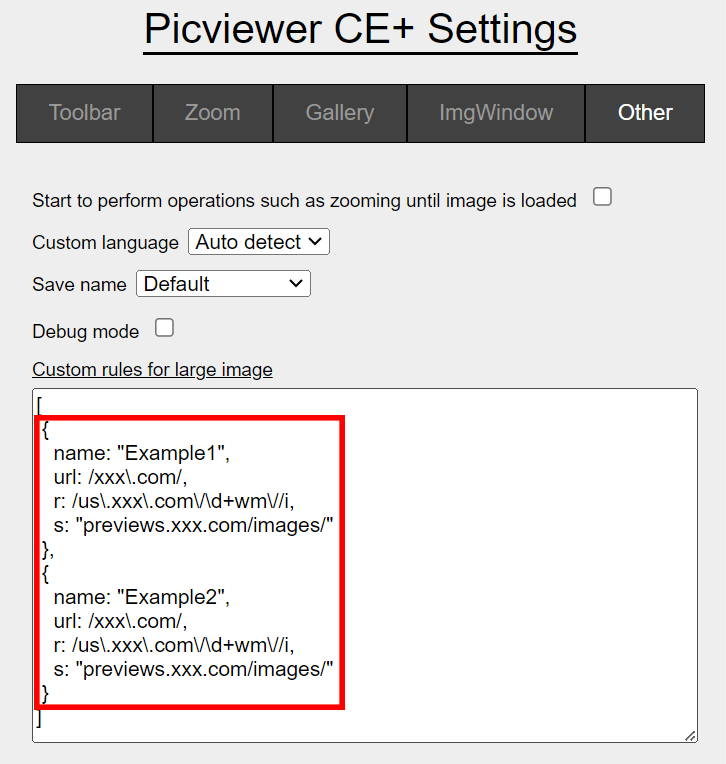

# 🏞️ Picviewer CE+

> Zoom images across all your favorite websites. Pop up, scale, edit, rotate, batch save images, or automatically load pictures from subsequent pages. Simply hover your mouse over any image and click the icons on the float bar.

+ **Adjust:** Scale/rotate/batch save every picture

+ **View:** Find and popup large version for pictures with click or mouse over

+ **Fetch:** Auto load and parse next paginated web
 pages and show ALL pics

+ **Download:** Pictures export to page or package into ZIP

+ **Search:** Search similar image by picture

+ View long image by scroll

Press `CTRL + G` to quickly enter the gallery. Hold `CTRL` to view a larger picture when hovering over images or links.

There are additional settings available in the "Picviewer CE+ config" for further customization. Currently, reviewing these settings is the best way to learn about the script's capabilities. Try exploring more functions on your own!

If you are glad to assist with the translation, please [🌐edit this file](https://github.com/hoothin/UserScripts/blob/master/Picviewer%20CE%2B/pvcep_lang.js#L1). It will be beneficial for individuals who speak the same language as you do. Thank you for your help.

Need more rules for peculiar sites? feel free to pull requests or open issues.


## 🔧 Custom [Rules Example](pvcep_rules.js):
**💝 Buy me a coffee with [Ko-fi](https://ko-fi.com/hoothin) or [愛發電](https://afdian.net/a/hoothin) to keep my scripts always up to date.**



``` json
// Match image src(no matter which site) with /pics\.dmm\.co\.jp/i and replace image url from "ps.jpg" to "pl.jpg"
{
    "name": "Dmm",
    "src": "/pics\\.dmm\\.co\\.jp/i",
    "r": "ps.jpg",
    "s": "pl.jpg"
}
```
``` json
// Match site with /xxx\.com/ and replace image url from /us\.xxx\.com\/\d+wm\//i to "previews.xxx.com/images/"
{
   "name": "Example",
   "url": "/xxx\\.com/",
   "r": "/us\\.xxx\\.com/\\d+wm//i",
   "s": "previews.xxx.com/images/"
}
```
``` json
//Add click-to-open for existing asiansister rule.
{
    "name": "Asiansister",
    "clickToOpen": {
        "enabled": true,
        "preventDefault": true,
        "type": "actual"
    }
}
```
You have the option to use a standalone userscript, which allows you to manage all of your custom rules effectively.

``` js
// ==UserScript==
// @name         Picviewer CE+ custom rules
// @namespace    hoothin
// @version      0.1
// @description  Picviewer CE+ custom rules
// @author       You
// @match        *://*/*
// @run-at       document-start
// @grant        none
// ==/UserScript==

(function() {
    'use strict';
    window.pvcepRules = window.pvcepRules || [];
    window.pvcepRules.push(
        ...
        [
            //Delete these two example rules and add your own.
            {
                name: "rule1",
                src: /pics\.dmm\.co\.jp/i,
                r: "ps.jpg",
                s: "pl.jpg"
            },
            {
                name: "rule2",
                url: /xxx\.com/,
                r: /us\.xxx\.com\/\d+wm\//i,
                s: "previews.xxx.com/images/"
            }
        ]
    );
})();
```

 <details>
<summary><h2>Advance rule wizard</h2></summary>

  There are two types of rules available:
  + JSON (simple mode)

    These rules are written in JSON format and can be imported online through [discussions](https://github.com/hoothin/UserScripts/discussions).
    They won't limited by websites that have a strict Content Security Policy that disallows unsafe-eval.
    + JSON params
      - name

        `"name": "rule name"`

        Name of the rule
      - url

        `"url": "^https://google\\.com"`
        
        Regular expression used to match the site URL.
      - src

        `"src": "^https://image\\.xx\\.com"`
        
        Regular expression used to match the image src
      - r

        `"r": "/(.*)\\d+/i"`
        
        Regular expression used to replace the image src from
      - s

        `"s": "$1"`
        
        Replace the image src to
      - ext

        `"ext": "previous"`
        
        Capture nearby image element when the mouse hovers over a non-image element.
      - lazyAttr

        `"lazyAttr": "data-lazy"`
        
        Lazy loaded original image URL attribute name
      - xhr

        `"xhr": { "url": ".showcase__link", "query": "img[fetchpriority]" }`
        
        Fetch the link above the image that matches ".showcase__link" and query the "img[fetchpriority]" on the inner page from the link.
  + JS (full mode)

    These rules are written in JavaScript object format. If you are not using a standalone userscript, they may be limited by websites that have a strict Content Security Policy that disallows unsafe-eval.
    + JS params
      - all mentioned above and the function type instead of string type
      - getImage
      - getExtSrc

 </details>

## Blank Gallery Page
[https://hoothin.github.io/UserScripts/Picviewer%20CE+/gallery.html](https://hoothin.github.io/UserScripts/Picviewer%20CE+/gallery.html)

*A blank gallery page designed for viewing local or online pictures, showcasing every image you have imported.*

Include `mode=`*`1`* to open gallery in view-more mode.<br/>
Add `imgs=`*`http://xxx/xxx.jpg`* to import images. ` ` to split multi-image, `[01-09]` to generate nine urls form 01 to 09<br/>
For example: 
```url
https://hoothin.github.io/UserScripts/Picviewer%20CE+/gallery.html?mode=0&imgs=http://xxx/xxx[01-99].jpg
```
Just easily drag and drop your local images into the gallery to view them.


## Thousands compatible sites for find larger or original images like

deviantart.com
google.com
wikipedia.org
dribbble.com
bing.com
imdb.com
github.com
tumblr.com
youtube.com
pixiv.net
steampowered.com
itunes.apple.com
pinterest.com
gelbooru.com
discordapp.com
twitter.com
fandom.com
reddit.com
yande.re
wallhaven.cc
500px
nyaa
e621.net
nhentai.net
tieba.baidu.com
douban.com
weibo.com
bilibili.com
t.qq.com
huaban.com
hujiang.com
dianping.com
trakt.tv
music.163.com
rule34hentai.net
photosight.ru
boqingguan.com
178.com
zhisheji.com
themex.net
operachina.com
topit.me
bcy.net
zhihu.com
autohome.com.cn
bitauto.com
xcar.com.cn
pcauto.com.cn
auto.sina.com.cn
baike.baidu.com
nvshens.com
24meitu.com
acgget.com
lofter.com
sohu.com
taobao.com
alibaba.com
yihaodian.com
addons.mozilla.org
crsky.com
firefox.net.cn
jd.com
dangdang.com
detail.zol.com.cn
duokan.com
youku.com
yyets.com
xiaohongshu.com
moegirl.org
fanfou.com
meipai.com
game.yesky.com
dota2.sgamer.com
mafengwo.cn
588ku.com
ibaotu.com
58pic.com

And so on ...
